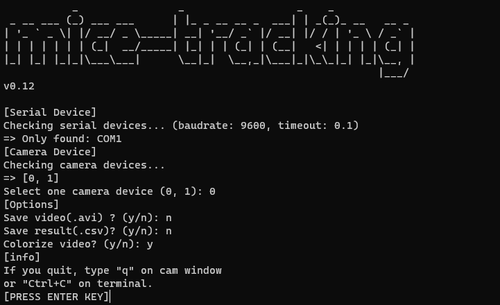
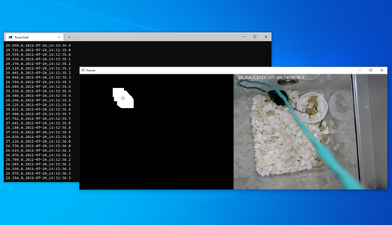

# mice behavior tracking

[](https://github.com/eggplants/mice-behavior-tracking/actions/workflows/build.yml)

- A system that captures the movement of a mice
- Real-time calculation from camera
- output of the amount of movement of the center of gravity
  - CSV(`displacement_of_mice,int(elapsed_sec/10),timestamp`)
  - AVI(color or monochrome)
- Available on Python 3.9 or more

## Binaries (Windows, Mac, Linux)

See: [Releases](https://github.com/eggplants/mice-behavior-tracking/releases)

## Local build

```bash
# On Windows
pyinstaller -F src/tracking_GUI.py -i img/icon.ico --version-file file_version_info.txt
# On Linux and Mac
pyinstaller -F src/tracking_GUI.py -i img/icon.ico
```

## Author

- original code written by shikama
- modified by [natsukacha](https://github.com/natsukacha)
- modified by [eggplants](https://github.com/eggplants)

## Icon

- <https://icon-icons.com/icon/testing-mouse-sciencie-scientific/53002>


## Screenshots


